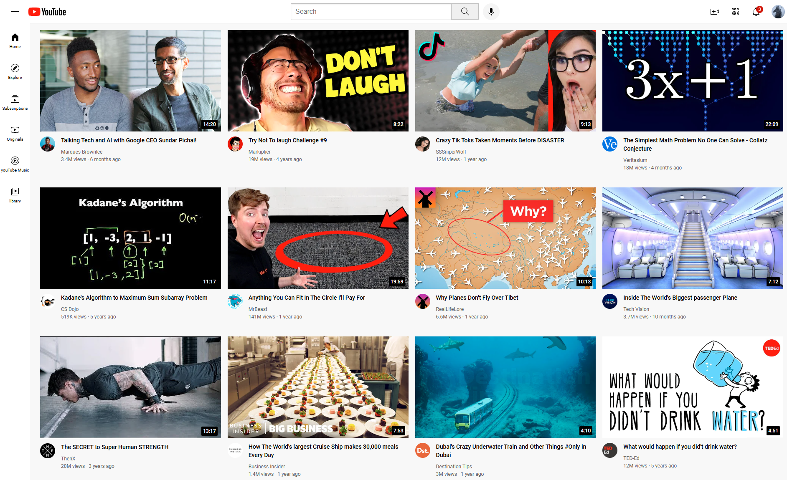

# YouTube Clone

This is a simple YouTube Clone project built using HTML and CSS. The project replicates the basic user interface of YouTube, including its layout and styling. It serves as a foundational project to practice frontend development skills.

## Features

- **Responsive Design**: The layout is designed to adjust to various screen sizes.
- **Navigation Bar**: Includes a logo, search bar, and navigation icons.
- **Video Section**: Displays a grid of video thumbnails with titles, views, and timestamps.
- **Sidebar**: Contains links for different categories (e.g., Home, Trending, Subscriptions).
- **Footer**: Includes additional links and copyright information.

## Technologies Used

- **HTML**: For structuring the content.
- **CSS**: For styling the layout and ensuring responsiveness.

  ## Screenshots

  

  ## Acknowledgments

This project was inspired by YouTube's UI and created as a learning exercise in HTML and CSS. It does not include any backend functionality and is for educational purposes only.
